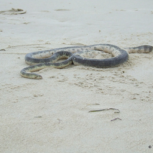
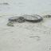
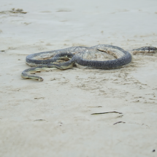
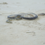

# InverseDiffusion: Diffusion Inverse Solvers based on Huggingface/diffusers

## Dependency
* pyyaml 
* Huggingface/diffusers
    * For now, you need a specific fork of diffusers
        ```bash
        git clone git@github.com:tongdaxu/diffusers.git
        cd diffusers
        pip install -e .
        ```
* models
    * Download model via git
        ```bash
        cd InverseDiffusion
        git lfs install
        git clone git@hf.co:xutongda/adm_imagenet_256x256_unconditional
        ```
    * Or manually download at https://huggingface.co/xutongda/adm_imagenet_256x256_unconditional/tree/main
* datasets
    * Download at https://huggingface.co/datasets/xutongda/ImageNet_val1k_256/tree/main
    * unzip it and replace the dataset path of yaml file
    * e.g.
        ```
        cd InverseDiffusion
        wget https://huggingface.co/datasets/xutongda/ImageNet_val1k_256/resolve/main/val_256x256.zip
        unzip 
        ```

## Currently Supported Configs
* We are still working to support more datasets, DIS algorithms and operators
* Supported DIS
    * DPS [1]: configs/pipe_dps.yaml
* Supported operators:
    * Down-sample: configs/op_downsample.yaml

## Usage
```bash
python main.py --pipe $PIPELINE_CONFIG --op $OPERATOR_CONFIG
```

## Example Run
* DPS for super-resolution
    ```bash
    python main.py --pipe configs/pipe_dps.yaml --op configs/op_downsample.yaml
    ```
* You should be able to produce
* source image

    
* down-sampled image

    
* sr image

    
* down-sampled of sr image

    


## Contribution
* Submit an issue / PR. Be sure to run ruff check and format before PR.

## Reference
* [1] Chung, H., Kim, J., McCann, M.T., Klasky, M.L., & Ye, J.C. (2022). Diffusion Posterior Sampling for General Noisy Inverse Problems. ArXiv, abs/2209.14687.